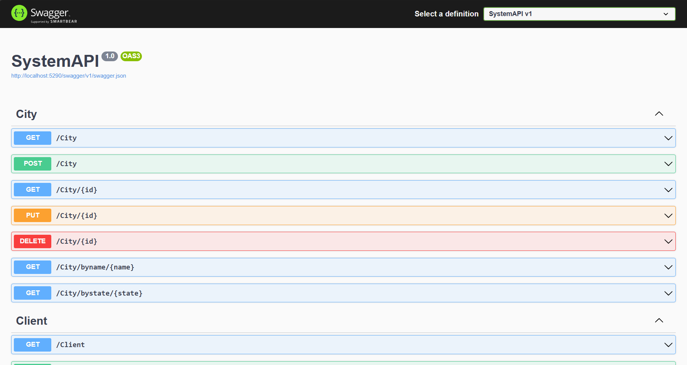

# erp-system-api

<h4 align="center">A Web API to provide informations about customers and where they live.</h4>

<p align="center">
  <a href="#how-to-use">How To Use</a> •
  <a href="#license">License</a>
</p>

<h1 align="center">
    
</h1>

## How To Use

To clone and run this application, you'll need [Git](https://git-scm.com), [.NET](https://learn.microsoft.com/en-us/dotnet/core/install/) and [SQL Server](https://www.microsoft.com/en-us/sql-server/sql-server-downloads) installed on your computer. From your command line:

```bash
# Clone this repository
$ git clone https://github.com/thalissoncastrog/erp-system-api.git

# Go into the repository
$ cd erp-system-api

# Go into the solution folder
$ cd src/SystemAPI

# Install dependencies
$ dotnet restore

# Create a .ENV file to setup your string connection to database
$ mkdir .env

# Put your string connection in .env file:
DATABASE_URL="Server=SERVER_NAME;Database=DATABASE_NAME;Trusted_Connection=True;TrustServerCertificate=True;"

# Run the app
$ dotnet run
```

> **Note**
> After run each command above, go to a web browser and access this url: http://localhost:[port]/swagger.

<h4>- For a better experience, use Docker:</h4>

> **Note**:
> Install docker according your operating system [Docker Instalation](https://docs.docker.com/engine/install/).

```bash
# Clone this repository
$ git clone https://github.com/thalissoncastrog/erp-system-api.git

# Go into the repository
$ cd erp-system-api

# Do the next commands as root user
$ sudo su

#Before this next command, put a password in the DockerfileSqlServer
# Create a image to run a sql server container
$ docker build -t thalissoncastrog/sqlserver:1.0.0 -f DockerfileSqlServer .

# Create a container from the image created before
$ docker run -d -p 1434:1433 thalissoncastrog/sqlserver:1.0.0

# Go into the solution folder
$ cd src/SystemAPI

# Install dependencies
$ dotnet restore

# Create a .ENV file to setup your string connection to database
$ mkdir .env

#The PASSWORD is the same in DockerfileSqlServer
# Put your string connection in .env file:
DATABASE_URL="Server=localhost,1434;Database=SystemApiDB;User Id=userSystemAPI;Password=<YOUR_PASSWORD>;Trusted_Connection=False;TrustServerCertificate=True;"

# Run the app
$ dotnet run
```

> **Note**
> After run each command above, go to a web browser and access this url: http://localhost:[port]/swagger.

## License

MIT

---

> Instagram [@thalissoncastrog](https://www.instagram.com/thalissoncastrog/) &nbsp;&middot;&nbsp;
> GitHub [@thalissoncastrog](https://github.com/thalissoncastrog) &nbsp;&middot;&nbsp;
> Email [thalisson.adao@gmail.com](mailto:thalisson.adao@gmail.com)
